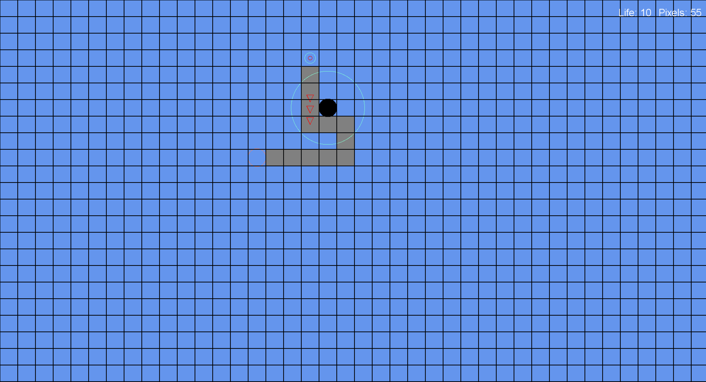

# Tower Defense Sandbox
Yet another project to learn game development and functional paradigm. The game reprosends prototype to the classical tower deffence.

[Roadmap](https://github.com/iivchenko/tower-defense-sandbox/wiki/Roadmap)

## Tech Stack:
* [MonoGame](https://github.com/MonoGame/MonoGame)
* [MonoGame.Extened](https://github.com/craftworkgames/MonoGame.Extended)
* [Myra](https://github.com/rds1983/Myra)
* [F#](https://github.com/dotnet/fsharp)
* Pure math!!!

# License

The game is open source software, licensed under the terms of MIT license. 
See [LICENSE](LICENSE) for details.